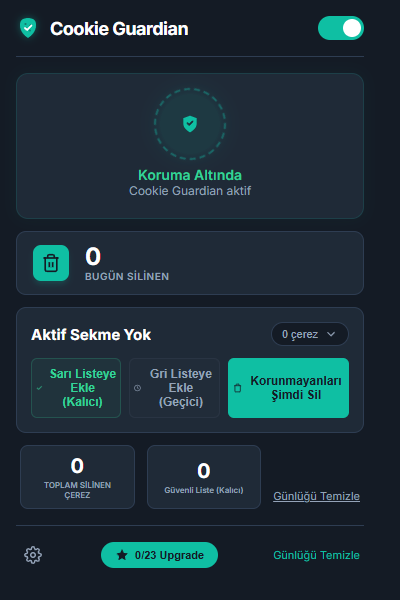
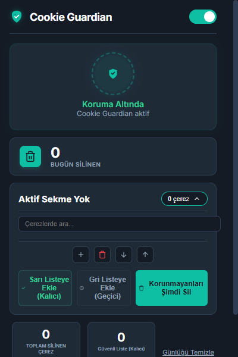
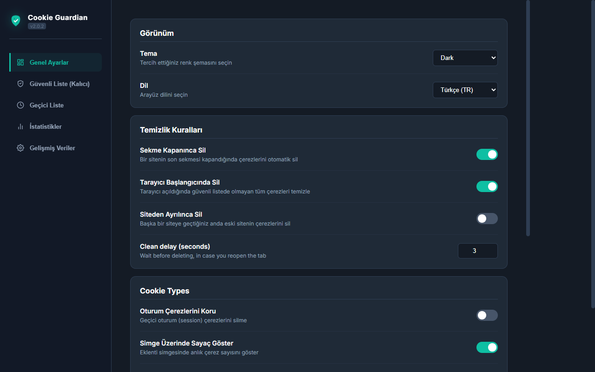
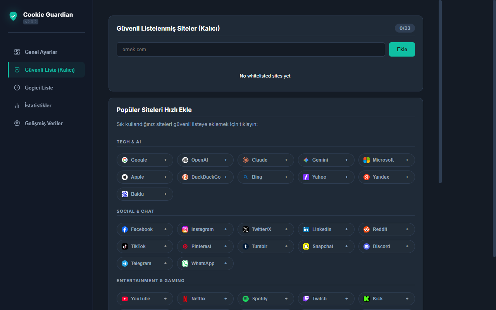
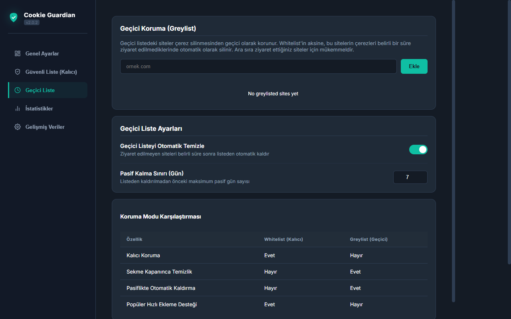
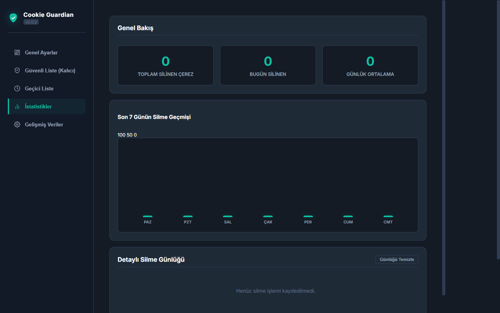
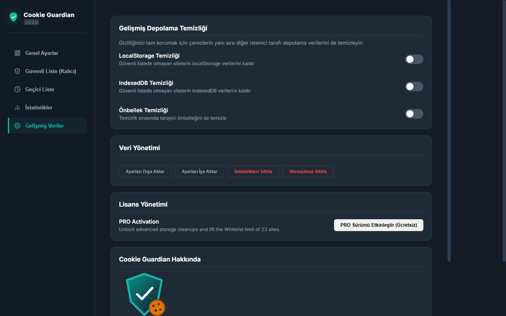

# Cookie Guardian 🛡️🍪

**Cookie Guardian** is a premium, high-fidelity browser privacy extension built with vanilla HTML, CSS, and JS (ES Modules) targeting the Manifest V3 specification. It puts you in complete control of your browser cookies, local data storage, and tracking footprints.

*Read this in: [English](#english) | [Türkçe](#türkçe)*

---

## English

### Key Features
- **Automatic Cleanup Rules:** Delete cookies immediately on tab close, browser startup, or when navigating away from a website.
- **Persistent Alarm Scheduling:** Automatic cleanups are scheduled using Chrome's persistent alarms, guaranteeing they survive browser idle states and background script suspension.
- **Base Domain Clearance:** Safely detects the root/registerable domain (e.g., `hbomax.com` from `play.hbomax.com`). When cleaning a site, it clears cookies on all sibling subdomains simultaneously, preventing login persistence through session-sharing trackers.
- **Integrated Interactive Cookie Editor:** 
  - Collapsible cards to edit cookie values, paths, SameSite, HttpOnly, Secure, Session, and Expirations.
  - Search filtering, cookie creation (+), importing from JSON, and exporting to JSON/clipboard.
- **Bilingual Interface:** Built-in dynamic localization supporting **English** and **Türkçe**. Automatically detects browser language and can be switched dynamically in settings.
- **Categorized Whitelist Quick-Add:** Includes 61 major platforms (including Kick) with brand favicons categorized for easy Whitelisting.
- **Advanced Cleansing:** Supports cleaning LocalStorage, IndexedDB databases, and browser Cache alongside cookies.

### Visual Walkthrough & Screenshots

#### Popup Interface
| Popup Dashboard | Popup Cookie Editor |
| --- | --- |
|  |  |

#### Options Panel Tabs
| 1. General Settings | 2. Whitelist Manager |
| --- | --- |
|  |  |

| 3. Greylist Manager | 4. Statistics & Logs |
| --- | --- |
|  |  |

| 5. Advanced Settings |
| --- |
|  |

### Installation (Developer Mode)
1. Clone this repository locally.
2. Open **Google Chrome** and navigate to `chrome://extensions/`.
3. Enable **Developer mode** in the top-right corner.
4. Click **Load unpacked** in the top-left corner.
5. Select the project root folder.

---

## Türkçe

### Öne Çıkan Özellikler
- **Otomatik Temizleme Kuralları:** Sekmeyi kapattığınızda, tarayıcı başladığında veya siteden başka bir adrese geçtiğinizde çerezleri anında siler.
- **Kalıcı Zamanlayıcılar (Alarms):** Tüm gecikmeli temizlik işlemleri tarayıcının kendi alarm yapısıyla yönetilir. Bu sayede arka plan kodları uykuya geçse bile süre dolduğunda çerezleriniz mutlaka silinir.
- **Kök Domain Temizliği:** Alt domain geçişlerini (örn: `play.hbomax.com` -> `hbomax.com`) otomatik algılar. Çerezler silinirken `auth.hbomax.com` gibi diğer tüm kardeş subdomain çerezleri de temizlenir; böylece oturumunuz yarım kalmaz, tam olarak kapatılır.
- **Entegre Çerez Düzenleyici (Cookie Editor):**
  - Çerezlerin değerlerini, yollarını, SameSite ayarlarını, son kullanma tarihlerini ve Secure/HttpOnly bayraklarını açılır kartlar halinde düzenleyebilirsiniz.
  - Arama filtreleme, yeni çerez ekleme (+), JSON formatında içe aktarma ve panoya dışa aktarma araçları mevcuttur.
- **Dinamik Çift Dil Desteği:** **Türkçe** ve **İngilizce** dillerini tam destekler. Tarayıcı dilini otomatik tanır ve ayarlardan anında dil geçişi yapmanıza olanak tanır.
- **Kategorize Edilmiş Güvenli Liste:** Kick dahil 61 popüler platform, kendi favicon logolarıyla kategorize edilerek kolayca Güvenli Liste'ye (Whitelist) eklenecek şekilde yerleştirilmiştir.
- **Gelişmiş Veri Temizliği:** Çerezlerin yanı sıra LocalStorage, IndexedDB veritabanları ve Tarayıcı Önbelleğini de temizleme seçeneği sunar.

### Görsel Anlatım ve Ekran Görüntüleri

#### Açılır Pencere (Popup) Arayüzü
| Kalkan Kontrol Paneli | Entegre Çerez Editörü |
| --- | --- |
|  |  |

#### Ayarlar Kontrol Paneli Sekmeleri
| 1. Genel Ayarlar | 2. Güvenli Liste (Whitelist) |
| --- | --- |
|  |  |

| 3. Gri Liste (Greylist) | 4. İstatistikler ve Günlükler |
| --- | --- |
|  |  |

| 5. Gelişmiş Araçlar |
| --- |
|  |

### Kurulum Kılavuzu
1. Bu depoyu yerel bilgisayarınıza indirin.
2. **Google Chrome**'u açın ve `chrome://extensions/` adresine gidin.
3. Sağ üst köşedeki **Geliştirici modu** seçeneğini etkinleştirin.
4. Sol üst köşedeki **Paketlenmemiş öğe yükle** butonuna tıklayın.
5. İndirdiğiniz klasörü seçerek eklentiyi kurun.
